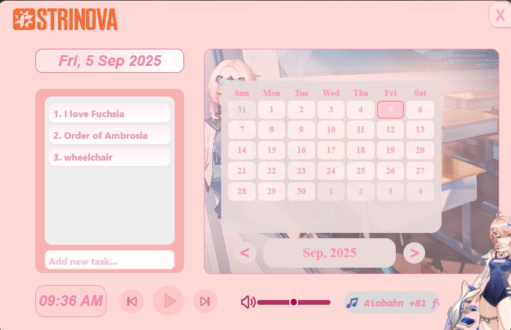

# Fuchsia-Widget
A Strinova Fuchsia themed Todolist/Calender
## Preview



## Features
1. Todolist to mark down your activities
2. Calendar View
3. A build in MP3 Player with volume control


## Requirements
[Node.js](https://nodejs.org/en/download/)

## How to install

```bash
# Clone this repository
git clone https://github.com/SilverWolfiee/Fuchsia-Todo-list.git
cd Fuchsia-Todo-list

# Install dependencies
npm install
```
Then run program using ```start.bat```
## how to use
To-do-list
1. To add task, type the task you want to add, then press enter
2. To remove task, Click on the task you have done doing.
3. To add your own song, download an mp3 file then paste it to ```assets/lofi```'
